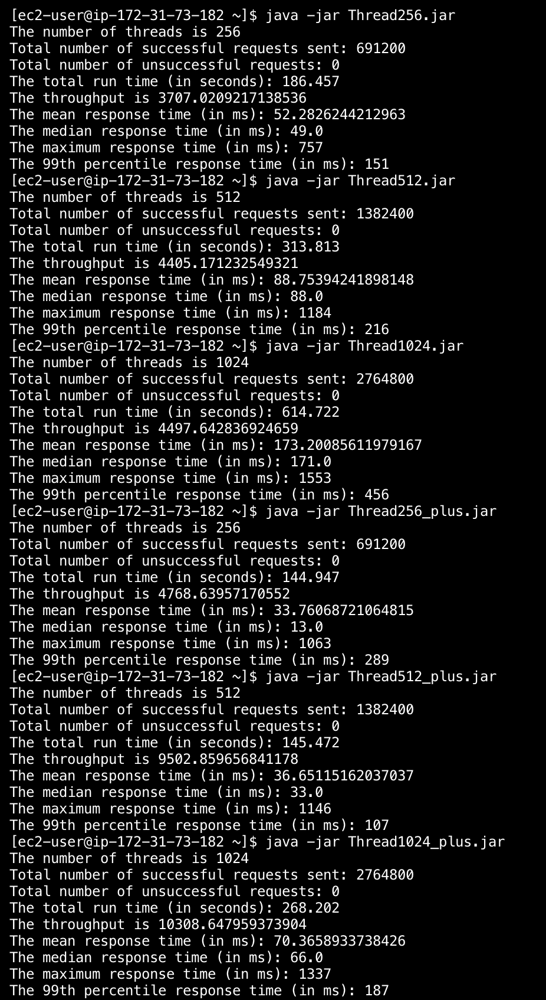

# Distributed-Store-Server-System

· Created a Multithreaded Java Client to upload a day of item purchases from multiple stores in different time zones and exert various heavy concurrent loads on the server, utilized different strategies to increase the throughput

· Built the sever to accept requests and store the data, then Load balancing incoming network traffic across multiple servers

· Scaling out the purchase database to enable Read/Write Splitting, shard the purchases data among instances

· Achieved asynchronous & stream processing by using RabbitMQ & Kafka broker, to reduce latencies

· Created a Microservice which also receives and records purchase data in H2 database, served to answer queries about store

In the final version: 
The client used 1024 threads to simulate 1024 stores. For each store, it will send 5 items per purchase, 300 purchases per hour and 9 hours pur day. 
The server side used four ec2 instances and a four partitioned kafka broker
The database is sharded into four rds instances
The throughput exceeded 10000, which is 10 times better than the first server version

Final Result page

